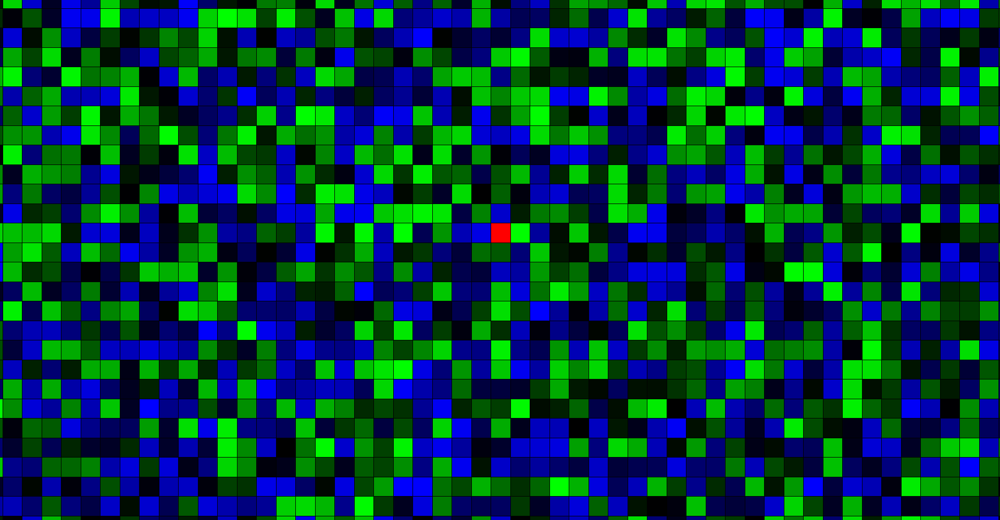
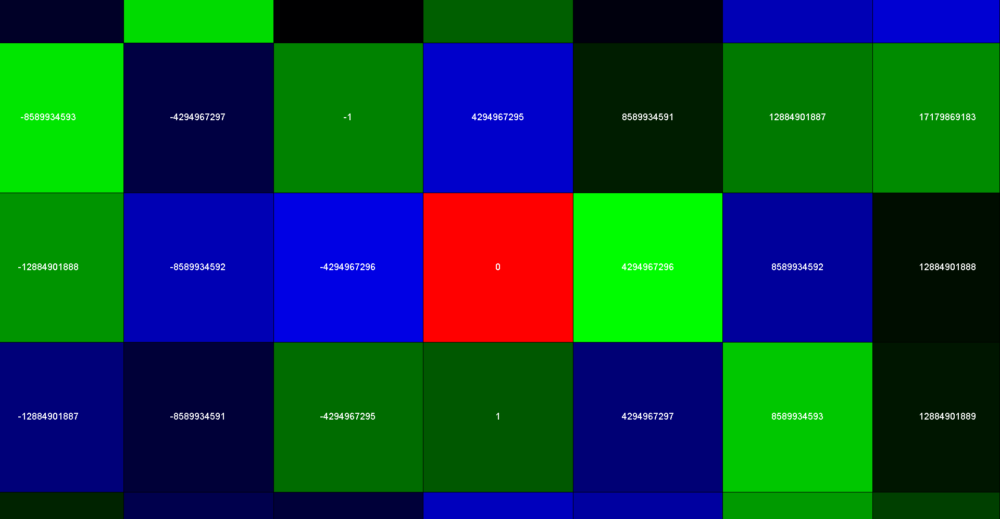

# Procedural Generator



## About

This is an application to visulise proceedural generation on a 2D plane with tiles.

Currently the application randomises the tiles between 2 colours, but in the future I hope to be able to implament a more complex form off generation, such as perlin noise.



## How to use

* You can hold down right click and move the mouse to pan around.
* You can use the scroll wheel to zoom in and out.
* (When you are close engouth to the tiles you can see their seed values)

## How it works

The application works by first creating a seed for the particular tile that is being generated.
It does this by taking the tile's x and y coordinates and combining them into one long by shifting the x value left 32 bits then doing an OR opperation.

```java
(((long) x) << 32) | (y & 0xffffffffL);
```

Then using that seed a random integer is generated between 0 and 1 using Lehmer algorithmn, to decide if the tile should be a shade of green or a shade of blue.

```java
randInt(0, 2)
```

Then the shade of that colour is generated (green).

```java
new Color(0, randInt(0, 256), 0);
```
